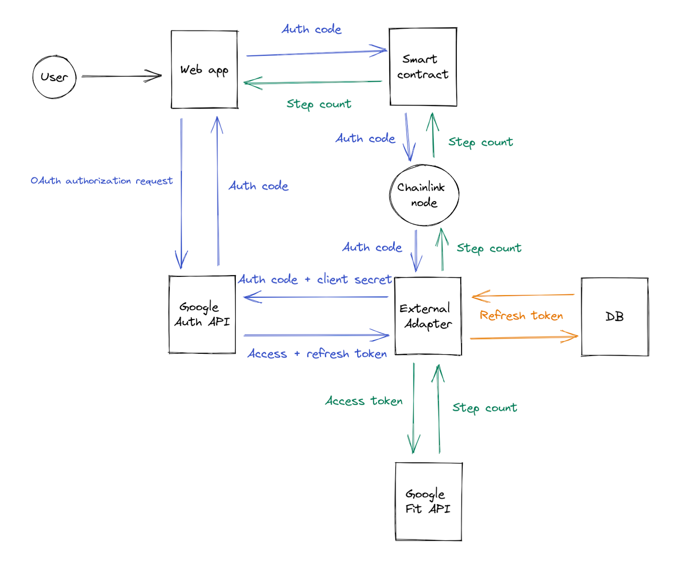
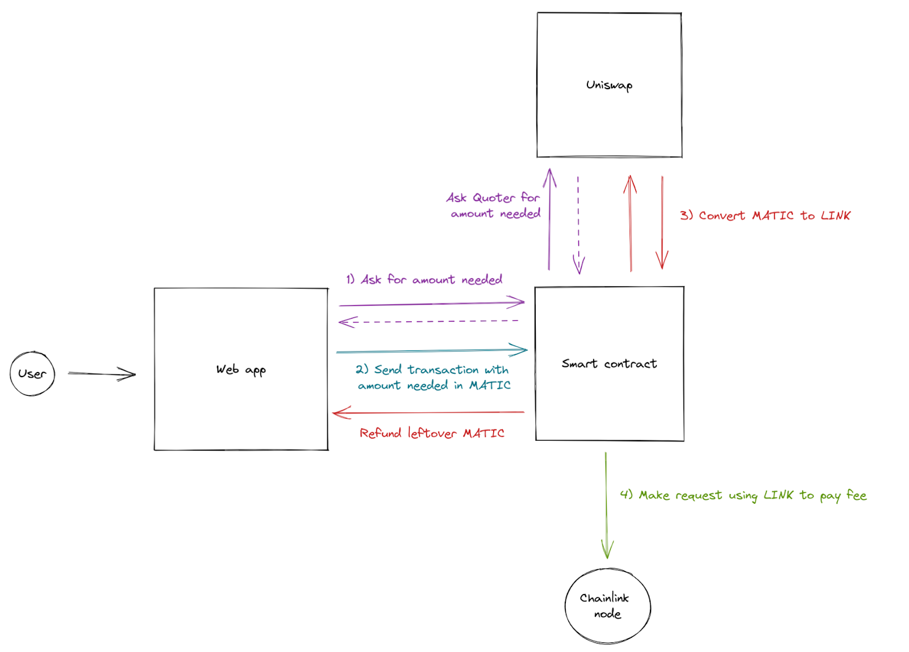
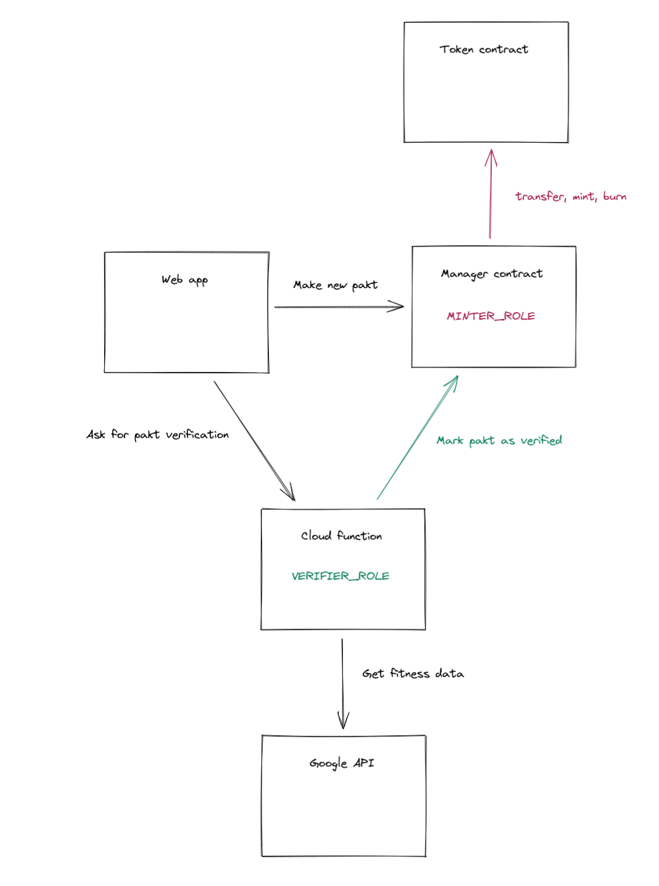

# Pakt

Homepage: https://pakt-web-app.vercel.app/

Docs: https://pakt.gitbook.io/docs

## Overview

### Why is it so hard to build new habits?

1. Too much content online, don’t know where to start
2. Too ambitious
3. Relying on motivation
4. Lacking short term incentives

### What is Pakt?

1. Pick a goal
2. Bet money on your success
3. At the end of the pakt, you win or lose money depending on your result

## Technical challenges

### Get API data into smart contract

If I want the pact verification to be done on-chain, the smart contract has to get the health data somehow. Sending it from the web app is not a good idea because the contract can be accessed by other means and frontend data can always be changed by the user. The contract should be able to query the health API directly. Unfortunately, smart contracts can’t natively get data from the outside world, they can only see data that is on the blockchain. I have to use an Oracle like [Chainlink](https://chain.link/) that will get the data for us and write it on the smart contract in a decentralized way.

Chainlink has a concept called [External Adapter](https://docs.chain.link/docs/external-adapters/) that can be used to query specialized APIs and do some parsing and other stuff to sanitize the data. This should be done off-chain to reduce fees.

### Apple health API

If I want to track the user’s step count, I need to get it from the two most common smartphone OS providers: Google and Apple. Google has a [fitness REST API](https://developers.google.com/fit/rest), so no problem on this side. But Apple has a tighter policy. They have a service called [HealthKit](https://developer.apple.com/documentation/healthkit), but it’s only accessible via an iOS app. The user has to give their consent on their iPhone.

After doing some research, I found several possible solutions to this problem:

- Building our own iOS app to ask the consent of the user and host the data on our server → building an app is a lot of unnecessary work at this project stage, and hosting the data ourselves means security policies and centralization.
- Using a specialized service that gets data from health providers and exposes it as an API → [HumanAPI](https://reference.humanapi.co/reference/getting-started) seems promising but after contacting them, they told us that they don’t have a free tier and the paid tier starts at $5k/month, a prohibitive price for a starting project.
- Using some kind of [health exporting app](https://www.healthexportapp.com/) → I would still need to host the data somewhere, or ask the user to export each time I need the updated data, which is not practical.
- Using an [Apple Shortcut](https://betterprogramming.pub/create-an-apple-health-api-with-shortcuts-and-firebase-a76d178319b7) → Nice hack but has the same problems as the previous option.
- Using another health service’s app to get the user’s consent and query this service’s API. I actually discovered there is a [Google Fit app on iOS](https://apps.apple.com/fr/app/google-fit-suivi-dactivit%C3%A9/id1433864494). This is a great solution as the user will only need to give their consent once to share Apple data with Google, and I then only need to query Google’s API to get data from iOS and Android users.
- I still have to verify if all data can be transferred to Google fit. For example, when using Fitbit on Android, the [FitToFit app](https://play.google.com/store/apps/details?id=fitapp.fittofit) is needed to synchronize data between Fitbit and Google Fit.

### OAuth with a decentralized app

Getting the user’s consent to fetch their health data works with [OAuth](https://developers.google.com/identity/protocols/oauth2). There are several OAuth [flows](https://auth0.com/docs/get-started/authentication-and-authorization-flow) that we can use depending on if we only want a short-lived access token or a long-lived refresh token. Getting a refresh token requires a client secret issued by Google and that we keep private. I decided to keep it in the Chainlink external adapter (see the Technical architecture section for more detail).

### Hosting External Adapter and DB

I know that a project that uses data from health providers cannot be fully decentralized. I want to stay pragmatic and find the correct balance between user experience and decentralization. If I only get an access token from Google, the external adapter will be able to query the health API for a short time period. If I want to get updated data without asking for the user’s consent again, I need to store a refresh token that I can later exchange for a new access token. I want the simplest architecture that answers our need, so I decided to use a serverless key-value [Firestore](https://cloud.google.com/firestore) database and host the External Adapter as a [serverless function](https://cloud.google.com/functions) on Google cloud. This way, the function will only execute when I need to get updated health data from a user in a smart contract.

### Chainlink node

The smart contract cannot directly communicate with the External Adapter, it needs to go through a [Chainlink node](https://docs.chain.link/chainlink-nodes/). Operating a node is a specific job and at this stage, I think it’s better to use a node from a professional operator than to run our own node. I made a partnership with a node operator to set up a [bridge](https://docs.chain.link/docs/node-operators/) between their node and our External Adapter in order to create a [custom job](https://docs.chain.link/docs/jobs/) for our needs.

### Chainlink fee

In order to use the Chainlink ecosystem, we need to pay a fee in LINK token for every request. Keeping a safe amount of LINK in the contract has a significant cost and is not practical because it’s hard to predict how the app usage will evolve. I would also need to protect against malicious users that make a lot of requests to deplete the LINK reserve. A better system would be to make the user pay for the LINK fee when they verify the pakt as explained [here](https://medium.com/swlh/this-is-how-chainlink-oracles-work-on-ethereum-5e463d4cf429) in the "Offsetting Costs" section. I decided to use [Uniswap](https://uniswap.org/) for this. The idea is that the user sends some MATIC with the transaction in addition to the gas cost, the contract then uses Uniswap to convert the MATIC in LINK and uses the LINK to pay the fee for the request. The several steps needed are described [here](https://docs.google.com/document/d/1rC4nPyT1Kdol1-t0YIf8LhxE96cnpxu7CeE5JN_CMjU/edit#heading=h.khzxiy5vvbsx).

## Technical architecture

### Authorization flow (in blue)

1. User opens the web app and click the Google button
2. Users is redirected to Google authorization page, enters credentials and give consent
3. Google gives us an authorization code (we can only use this code with the client secret to get a token, so we can securely send this token in clear text)
4. Web app asks the user to validate the transaction that will send the authorization code to the smart contract
5. Smart contract sends a request to a Chainlink node, with the auth code as a parameter
6. Chainlink node calls the External Adapter with the auth code
7. External Adapter can securely use the client secret and the auth code to get an access and refresh token from Google

### Storing token for later use (in orange)

8. To query the API later without asking for the user’s consent again, the refresh token is stored in a simple key-value database

### Getting fitness data (in green)

9. External Adapter can now query Google Fit API with the access token (or get the refresh token if the access token has expired) and get the step count
10. External Adapter answers to the Chainlink node call by returning the step count
11. Chainlink node receives the step count and issues a transaction to write it on the smart contract
12. Web app reads the step count from the smart contract

### Swap MATIC for LINK with Uniswap

1. The Chainlink fee is constant so we know the output of the swap but we don’t know how much MATIC we need. Since the amount depends on the market price at the time of the swap, we need to get it just before doing the swap. I use the [Uniswap Quoter](https://docs.uniswap.org/protocol/reference/periphery/lens/Quoter) to get the precise amount needed for the swap.
2. We know the exact amount but since the price can change, the web app asks for a bit more from the user when sending the transaction.
3. The smart contract then uses the MATIC from the transaction to do a [swap](https://docs.uniswap.org/protocol/guides/swaps/single-swaps) and gets LINK from Uniswap in exchange. The MATIC leftover from the swap is refunded to the user.
4. The smart contract now has the exact LINK amount needed to pay the fee for the Chainlink request.

## Updated architecture

Why a new architecture? I realized that using Chainlink for each verification request was too expensive. Pakt is supposed to be about micro-incentives. If a user has to pay $0.5 for each pakt verification, the economics of the project need to be changed. Also, it seems using an oracle is really useful for decentralized requests like random numbers or token prices. But here it was only used to make a request to a centralized cloud function, so it doesn’t really make the project more decentralized than calling the cloud function directly from the web app.

Other advantages to this modification:

1. It greatly simplifies the architecture and the contract code. We no longer need to call the Chainlink contract, and we also no longer need to use Uniswap to get LINK tokens. This makes the app easier to test (no need to mock or fork) and reason about.
2. We can now add a small MATIC fee when the user wants to unlock their funds. This fee is a nice improvement to the business model.

## Tokenomics

### Goals

- Use financial incentives to help people build healthy habits
- Virtuous cycle: the project should become more successful as more people are using the app and reaching their goals
- Sustainability: the project should have steady income instead of one big win
- Simplicity: make economics as simple as possible

### Do we really need a token?

#### The original concept

Choose a challenge and the amount of money to lock → unlock only if challenge success
Issues:

- Project only makes money when people fail (not virtuous)
- It’s hard to convince people to use it when they can only lose money (without considering gas cost)

#### Without a token - solution 1

Direct competition between users and Pakt takes a fee

- I like the idea of being against yourself
- Could incentivize cheating if punishment for losing is too high

#### Without a token - solution 2

Invest the money locked and use earnings to pay people (and the project takes a fee)

- In practice, we could only get ~2-3% per year interest = less than $0.01 for a $10 weekly pakt
- → Doesn’t really work for small amounts and short time periods
- Maybe possible with scale?
- Too close to external economy

#### Advantages of a PAKT token

- We can choose our own rules to incentivize the behavior we want
- Token as a competitive moat: if most of the code is open source, the token is the only thing that cannot be copied (w/ the community)

### Mechanics

#### Mechanics of earnings and risk

- If you succeed your pakt, you earn some tokens
- If you fail, you don’t lose everything but a greater amount than what you can earn with the same pakt (eg. 4x → for a weekly pakt, you need to succeed for 1 month to recover for 1 failure)
- Irregular earnings like a lottery? May not work…
- How to handle someone betting a huge amount on a really easy pakt?

#### Predefined levels

- Each pakt type would have eg. 5 levels with a set range of tokens that you can bet
- Level 1 → 1..100 tokens (1000 steps / 7 hours sleep)
- Level 2 → 101..200 tokens (3000 steps / 7.5 hours sleep)
- Level 3 → 201..300 tokens (5000 steps / 8 hours sleep)
- Level 4 → 301..400 tokens (7000 steps / 8.5 hours sleep)
- Level 5 → 401..500 tokens (10k steps / 9 hours sleep)

#### Why an inflationary model?

- To reward users, we cannot create new money but we can create new tokens
- Unlimited supply
- The price of the token will change depending on:
  - the rate of inflation (more tokens in circulation)
  - if users feel like the app helps them building good habits (more holding and less selling)
  - how much people succeed or fail (more mint or burn)
- Reward users, not speculators: people who just buy the token without making pakts will get diluted over time
- Regulation (Howey test): must be a utility token and not just something that you buy hoping it will do 10x

#### Model 1: Dynamic inflation level

- Distribute more tokens if there is less usage to incentivize early users (inflation decay, a bit like Bitcoin)
- Usage can be computed with: (total amount of locked tokens) / (total supply) = usage (between 0 and 1)
- Choose a max and min inflation eg. max 20% and min 2%
- Inflation = max - (max - min) \* usage
  - if usage = 0 → inflation = 20 - 18 \* 0 = 20
  - if usage = 0.5 → inflation = 20 - 18 \* 0.5 = 11
  - if usage = 1 → inflation = 20 - 18 = 2
- Fixed token emission each week split in all winners?

#### Model 2: Fixed interest rate

- Choose an interest rate eg. 1% earnings for a weekly pakt
- Example: you buy 200 tokens and if you succeed your pakt you get 2 new tokens
- Greater rate for more difficult pakt levels? You get less diluted if you go up in levels
- The inflation will increase if more people succeed more pakts → helps keep the price not too high?

#### How the project makes money

- Some token preminting
- Token liquidity providing
- 10% of new tokens created goes to treasury (w/ vesting?)

#### 1 or 2 tokens?

- Some games use 1 token with variable supply as the game currency and 1 token with fixed supply as a "governance" token (~ shares of the company)
- May have regulatory risk

#### Token price and liquidity

- 50/50 liquidity pool (eg. Uniswap)
- pool = 1K MATIC / 1M PAKT → 1 PAKT = 0.001 MATIC
- someone buys 1000 PAKT (cost: 1 MATIC)
- pool = 1001 MATIC / 999K PAKT → 1 PAKT = 0,001002002 MATIC

#### Token distribution

- 1M PAKT in pool
- 10M premined in treasury? (w/ vesting?)
- 10% of rewards in treasury (w/ vesting?)
- Block minting out of these rules?
